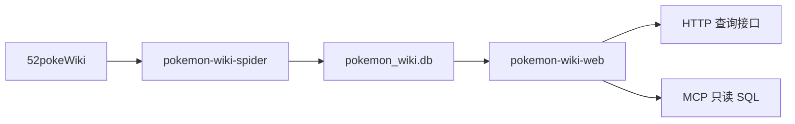

# Pokemon Wiki

[](https://github.com/fantasticmao/pokemon-wiki/actions)

[](https://codecov.io/gh/fantasticmao/pokemon-wiki)
[](https://hub.docker.com/r/maomao233/pokemon-wiki)
[](LICENSE)

## 这是什么

Pokemon-Wiki 从 [神奇宝贝百科](https://wiki.52poke.com/wiki/主页) 抓取宝可梦、特性、招式与道具，将解析结果写入 SQLite，再以 HTTP 接口对外提供查询。Pokemon-Wiki 提供聚合后的只读查询，不提供百科镜像、页面编辑或运行时自动更新。

> [!IMPORTANT]
> 条目原文与图片仍归属神奇宝贝百科，详见该站 [版权声明](https://wiki.52poke.com/wiki/%E7%A5%9E%E5%A5%87%E5%AE%9D%E8%B4%9D%E7%99%BE%E7%A7%91:%E7%89%88%E6%9D%83%E5%A3%B0%E6%98%8E)。

## 关键特性

- **页面抓取**：使用 [jsoup](https://github.com/jhy/jsoup) 并行抓取列表页与详情页。
- **离线数据**：将解析结果写入仓库中的 [`pokemon_wiki.db`](https://github.com/fantasticmao/pokemon-wiki/blob/master/pokemon_wiki.db)。
- **查询接口**：提供宝可梦、特性、招式与道具的列表与详情。
- **模型查询**：提供 MCP Server，支持大模型查询宝可梦数据。
- **容器发布**：在 Docker Hub 提供可运行的查询服务镜像。

## 下载与安装

Pokemon-Wiki 以容器镜像与源码两种方式分发。

- **容器镜像**：从 Docker Hub 拉取 `maomao233/pokemon-wiki`。
- **源码构建**：在 JDK 21 下执行 `./mvnw package -B -Dapp.dbfile=$(pwd)/pokemon_wiki.db`。

## 快速开始

基于 Docker 可快速启动应用服务：

```bash
docker run -p 8080:8080 maomao233/pokemon-wiki
```

或在已完成源码构建后，执行命令：

```bash
java -Dapp.dbfile=./pokemon_wiki.db -jar pokemon-wiki-web/target/pokemon-wiki-web.jar
```

Pokemon-Wiki 本地启动时默认监听 8080 端口。常用查询在线示例如下：

- **宝可梦详情**：<https://pokemon.fantasticmao.cn/pokemon/detail?nameZh=妙蛙种子>
- **特性详情**：<https://pokemon.fantasticmao.cn/ability/detail?nameZh=茂盛>
- **招式详情**：<https://pokemon.fantasticmao.cn/move/detail?nameZh=飞叶快刀>

> [!TIP]
> 完整请求参数与返回字段见 [接口文档](docs/)。

Pokemon-Wiki 同时提供 MCP 端点 `/mcp`，协议为 Streamable HTTP，需要在 Agent `mcpServers` 配置中填写该端点：

```json
{
  "mcpServers": {
    "pokemon-wiki": {
      "url": "https://pokemon.fantasticmao.cn/mcp"
    }
  }
}
```

## 工作原理

### 架构

Pokemon-Wiki 由爬虫模块与查询模块组成。前者负责抓取百科页面并写入 SQLite；后者只读该库，并以 HTTP 接口和 MCP 端点对外提供查询。两个模块独立构建与运行。

> [!NOTE]
> 查询服务启动后不再访问百科站点。

### 核心流程

Pokemon-Wiki 先抓取六类列表页，再按列表索引并发抓取详情页，最后将解析结果写入 SQLite。查询服务启动后读取该数据库并响应请求。



## 常见问题

### 为何接口数据不是百科站点的实时内容？

查询模块只读预置的 SQLite 文件，运行时不访问百科站点。需要更新数据时，另行运行爬虫并替换该数据库文件。

### 为何二次开发可以直接使用仓库中的数据库？

爬虫将解析结果写入已纳入版本库的 `pokemon_wiki.db`。克隆仓库后即可连接该文件，无需先运行爬虫。

### 为何项目声明仅提供组合查询？

条目原文与图片仍归属神奇宝贝百科。使用数据须同时遵守该站 [版权声明](https://wiki.52poke.com/wiki/%E7%A5%9E%E5%A5%87%E5%AE%9D%E8%B4%9D%E7%99%BE%E7%A7%91:%E7%89%88%E6%9D%83%E5%A3%B0%E6%98%8E) 与本仓库 [LICENSE](LICENSE)。

## 更新日志

版本变更见 [CHANGELOG.md](CHANGELOG.md)。

## 许可

许可条款见 [LICENSE](LICENSE)。
